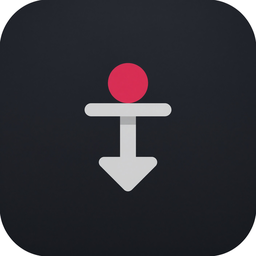

#  PiLoad

Windows, Linux and macOS (Apple Silicon) program that starts **yt-dlp on a DietPi Raspberry Pi over SSH**.


## Download

- [Windows](https://github.com/abb0r/piload/releases/latest/download/PiLoad.exe)
- [Linux](https://github.com/abb0r/piload/releases/latest/download/PiLoad-linux-amd64)
- [macOS Apple Silicon](https://github.com/abb0r/piload/releases/latest/download/PiLoad-macos-arm64)

On startup PiLoad checks GitHub for a newer release and asks before updating.

## Settings in the app

On the **Settings** tab enter host, port `22`, user (`dietpi`) and a password or key file.
On the **Download** tab paste one video URL per line, then send them over SSH.

## yt-dlp on DietPi

Install yt-dlp from the DietPi software list: [dietpi.com/docs/software](https://dietpi.com/docs/software/)  
(`dietpi-software` → Browse/Search → **yt-dlp**)

Also install ffmpeg on the Pi:

```bash
sudo apt update
sudo apt install -y ffmpeg
```

Optional, for embedded metadata and thumbnails:

```bash
sudo apt install -y atomicparsley python3-mutagen
```

SSH must be reachable on the Pi (enable OpenSSH in DietPi).
The PC running PiLoad.exe must be on the same LAN.
