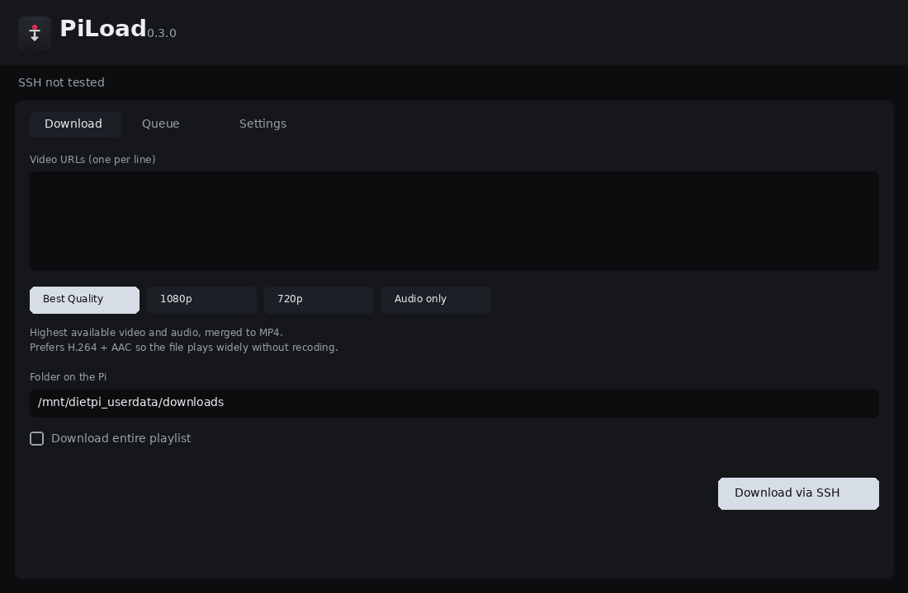

# PiLoad

Windows program that starts **yt-dlp on a DietPi Raspberry Pi over SSH**.



## Windows

[Download PiLoad for Windows](https://github.com/abb0r/piload/releases/latest/download/PiLoad-windows.zip)

Unzip the archive and run `PiLoad.exe` from the extracted folder. Keep the folder together — the `.exe` does not work on its own.

Windows Defender sometimes flags unsigned Python apps (`Wacatac`, `Bearfoos`). That is a false positive. Restore the file from quarantine and allow it if you downloaded it from this repository.

## Setup in the app

On the **Setup** tab enter host, port `22`, user (`dietpi`) and a password or key file.
On the **Download** tab paste one video URL per line, then send them over SSH.

## yt-dlp on DietPi

Install yt-dlp from the DietPi software list: [dietpi.com/docs/software](https://dietpi.com/docs/software/)  
(`dietpi-software` → Browse/Search → **yt-dlp**)

Also install ffmpeg on the Pi:

```bash
sudo apt update
sudo apt install -y ffmpeg
```

Optional, for embedded metadata and thumbnails:

```bash
sudo apt install -y atomicparsley python3-mutagen
```

SSH must be reachable on the Pi (enable OpenSSH in DietPi).
The PC running PiLoad.exe must be on the same LAN.
