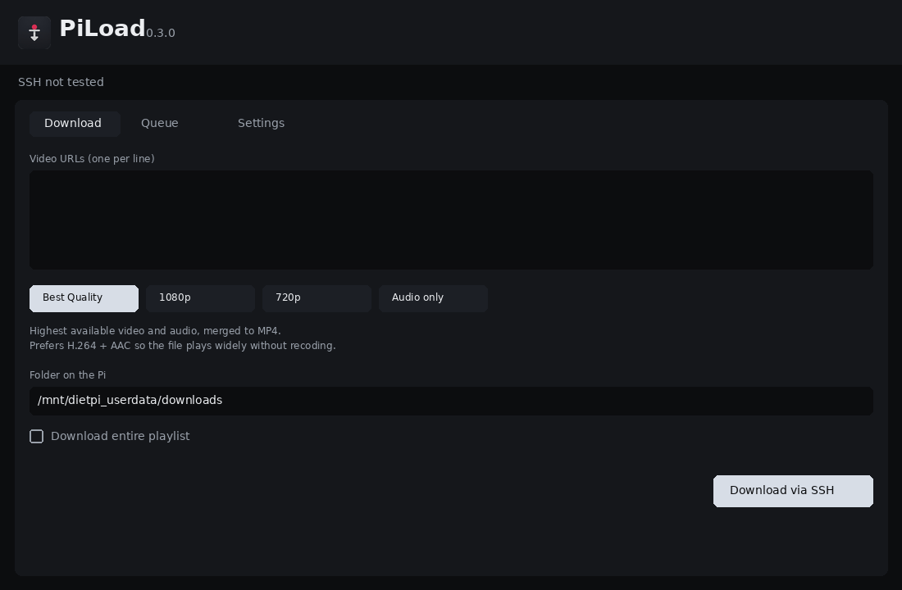

#  PiLoad

Windows, Linux and macOS (Apple Silicon) app for **yt-dlp**. Download on this computer, or on a DietPi Raspberry Pi over SSH.



## Download

- [Windows](https://github.com/abb0r/piload/releases/latest/download/PiLoad.exe)
- [Linux Flatpak](https://github.com/abb0r/piload/releases/latest/download/PiLoad-linux-x86_64.flatpak)
- [macOS Apple Silicon](https://github.com/abb0r/piload/releases/latest/download/PiLoad-macos-arm64.dmg)

On startup PiLoad checks GitHub for a newer release and asks before updating. If yt-dlp is already installed for local downloads, that check can also offer a newer yt-dlp. FFmpeg is updated only together with that, and Deno only when it is too old for YouTube.

### Linux

```bash
flatpak install --user PiLoad-linux-x86_64.flatpak
flatpak run com.abb0r.PiLoad
```

### macOS

Open the `.dmg` and drag **PiLoad.app** to Applications.

## Use

On the **Download** tab choose **Raspberry Pi** or **This PC**, paste one video URL per line, pick a quality, and start.

| Profile | Result |
| --- | --- |
| Best Quality | Highest video and audio, merged to MP4 |
| 1080p | Up to 1080p, merged to MP4 |
| 720p | Up to 720p, merged to MP4 |
| Audio only | Best audio, saved as MP3 |

On the **Settings** tab set the Pi connection, the folder on the Pi, and the folder on this computer. The local default is Videos on Windows, Movies on macOS, and the Videos directory on Linux.

The first local download fetches yt-dlp, FFmpeg, ffprobe and Deno if they are missing:

- Windows: `bin` next to `PiLoad.exe`
- macOS: `~/Library/Application Support/PiLoad/bin`
- Linux: the app data folder

## yt-dlp on DietPi

Install yt-dlp from the DietPi software list: [dietpi.com/docs/software](https://dietpi.com/docs/software/)  
(`dietpi-software` → Browse/Search → **yt-dlp**)

Also install ffmpeg on the Pi:

```bash
sudo apt update
sudo apt install -y ffmpeg
```

Optional, for embedded metadata and thumbnails:

```bash
sudo apt install -y atomicparsley python3-mutagen
```

SSH must be reachable on the Pi (enable OpenSSH in DietPi).
The computer running PiLoad must be on the same LAN.
